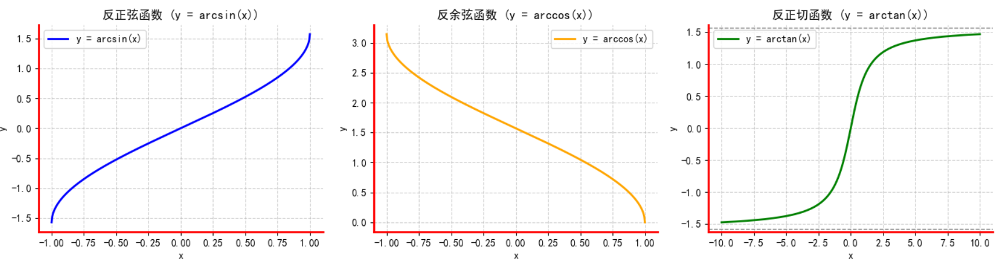
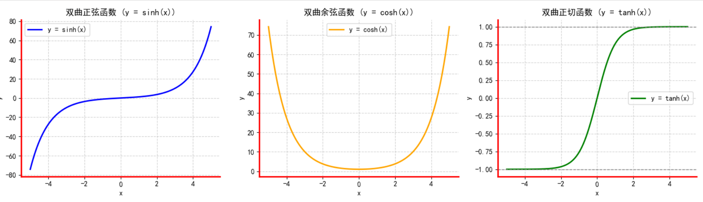

# 高等数学
* 偷懒不了一点，老老实实做例题
* **多做题**
* 收集知识点与常用公式等一切可以打在md上的东西

## C1 函数
### 1.1 补充
* 倍角函数：
    * $\sin 2x = 2\sin x\cos x$
    * $\cos 2x = \cos^2x-\sin^2x$
    * $\tan 2x= \frac{2\tan x}{1-\tan^2 x}$
* 基础反三角函数：

    * arcsinx：定义域[-1,1],值域$[-\frac{\pi}{2},\frac{\pi}{2}]$
    * arccosx：定义域[-1,1],值域$[0,\pi]$
    * arctanx：定义域$(-\infty,+\infty)$，值域$[-\frac{\pi}{2},\frac{\pi}{2}]$
* h系列函数：

* 三角函数倒数
    * $\sec x = \frac{1}{\cos x}$,导数为 $\sec x \tan x$
    * $\csc x = \frac{1}{\sin x}$,导数为 $-\csc x \cot x$
    * $\cot x = \frac{1}{\tan x}$,导数为 $-\csc^2 x$
* 函数性质：单调性，有界性，周期性，奇偶性，连续性（后续提及）
* 有界！= 极限，无界！= 无限，要求具有连续性
* 善用假定满足条件的函数，多举几个
* **泰勒公式**：$f(x) = \sum \frac{f^{(n)}(a)}{n!}(x-a)^n$
    * 拉格朗日余项：n+1项
    * 配亚诺余项：$R_n = o((x-a)^n)$,他表示余项是比n指数更高阶的无穷小，此时后面的项基本不管、
    * 麦克劳林公式：当a=0时候
    ### 
### 1.2 连续性与间断点
* 定义：在$x_0$的去心领域有定义，但是$x_0$不连续
* 间断点分类
    * 第一类间断点：左右极限存在
        * 可去间断点：左右极限相等
        * 跳跃间断点：左右极限不等
    * 第二类间断点：左右极限至少一个不存在
        * 无穷间断点：有一个极限为$\infty$
        * 震荡间断点：没有定义，没有极限

## C2 极限
### 2.1 常用极限
* 如下
    > $\lim_{x \to 0}(1+\frac{1}{x})^x = e$    
    > $\lim_{x \to \infty} (1+x)^\frac{1}{x} = e$  
    > $\lim_{x \to 0} \frac{a^x-1}{x} = \ln a$  
    > $\lim_{n \to \infty} n^{-n} = 1$  
    > $\lim_{n \to \infty} a^{-n} = a (a > 0)$  
    >   * 理解为无限制求平方根，大于1的必定大于1  
    > 
    > $\lim_{x \to \infty} \frac{\sum_{i=0}^n a_n x^n}{\sum_{i=0}^n b_n x^n} $
    >   * 当n = m时极限为$\frac{a_n}{b_m}$，其他情况显然
* $1^\infty$ 常用结论:
    > 如果 $\lim \alpha(x) = 0,\lim \beta(x) = \infty,且\lim \alpha(x)\beta(x) = A$  
    > 则 $\lim[1+\alpha(x)]^{\beta(x)} = e^A$
    > 第一条，第二条的扩展，通过 $a^b=e^{(\ln a)b}$ 证明
* 泰勒公式展开
    > 常用展开：$e^x, \sin x, \cos x, \ln(1+x), (1+x)^n$  
    > * $e^x = \sum_{i=0}^{n}\frac{x^n}{n!}$
    > * $\sin x = \sum_{i=0}^{n}(-1)^{n-1}\frac{x^(2n-1)}{(2n-1)!}$
    > * $\cos x = \sum_{i=0}^{n}(-1)^{n}\frac{x^{2n}}{(2n)!}$
    > * $\ln(x+1) = \sum_{i=0}^{n}(-1)^{n-1}\frac{x^n}{n!}$
    > * $(1+x)^n = \sum_{i=0}^{n}\frac{\frac{a!}{(a-n)!}}{n!}x^n$  
    > **展开至高阶无穷小**

### 2.2 考虑左右极限的情况：
* 分段函数：分界点两端的表达式不同
* $e^\infty$类型：$\lim_{x \to 0} e^\frac{1}{x}, \lim_{x\to\infty}e^x$：极限分为正负极限，正负极限的符号始终不同
* $\arctan\infty$： $\lim_{x\to0} \arctan\frac{1}{x}$：同理，正负极限数值不对等
* 极限存在：夹逼定理，单调有界

### 2.3 无穷小：
> $\lim_{x \to anything} = \frac{\alpha(x)}{\beta(x)}$   
* = 0：高阶
* $\infty$：低阶
* $ = C \ne 0$：同阶
* = 1：等价
* 等价无穷小：
    > **替换规则：乘除无限制，加减仅限替换后不为0**
    > 
    > * x系列：$x \sim \sin x \sim \tan x \sim \arcsin x \sim \ln(x+1) \sim e^x-1$  
    > 指数系列可视作为了契合x做的偏移
    > * 常指数：$(1+x)^a -1 \sim ax$  
    > 高阶指数的重要解法
    > * 指数变量：$a^x-1\sim x\ln a$
    > 指数系列的扩展
    > * 等效x加减系列0：$1-\cos x\sim x-\ln (1+x)\sim \frac{1}{2}x^2$
    > * 等效x加减系列1：$x-\sin x \sim \arcsin x-x \sim\frac{1}{6}x^3$
    > * 等效x加减系列2：$\tan x-x \sim x - \arctan x \sim \frac{1}{3}x^3$
    > * 定积分：如果两个函数等价无穷小，则两个函数的** $\int_0^x$ 的定积分**仍等价无穷小
* 无穷大
    * 当$x\to+\infty$时：其中常数均为正
        > $\ln^a x \ll x^\beta \ll \alpha^x$
    * 当$nn\to\infty$时：其中常数均为正
        > $\ln^a n \ll n^\beta \ll \alpha^x \ll n! \ll n^n$
    * 无穷小和无穷大可转换

### 2.4 洛必达
* 要求：
    1. 不逼近无限
    1. 分子分母单独取极限均为0
    1. 能导
    > **导！**
### 2.5 求解方法

1. $\frac{0}{0}$:  洛，无穷小（凑），泰勒
1. $\frac{\infty}{\infty}$:  洛，最高阶通分
1. ${\infty}-{\infty}$：  通分为 $\frac{0}{0}$，根式有理化
1. ${0}\cdot{\infty}$： 化为1，2
1. $1^{\infty}$：凑
    * 扩展结论 $(1+\alpha(x))^{\beta(x)}= e^{\alpha(x)\beta(x)}$
    * 指数的二级结论：$\lim[f(x)]^{g(x)} = e^{g(x)ln[f(x)]} $
1. $\infty^{0}和0^0$:指数二级结论
1. 数列极限：不能用洛
    * 放缩夹逼
    * 定积分定义---提出核心定义 $\frac{1}{n}$
    > 定义：$\lim_{n\to\infty}\sum_{k=1}^{n}f(\frac{k}{n})$
* 有理运算法则
    * 优先计算非零极限因子
* **想方法凑**基本极限，等价无穷小
* 洛必达
* 泰勒公式展开
* 利用夹逼准则求极限
* 函数单调且有界

## C3 微分与导数
### 常用导数公式
* 一般   
    > $x^a \to ax^{a-1}$  
    > $a^x \to \ln a \cdot a^x$  
    > $\log_a x \to \frac{1}{x\ln a}$
* 三角函数  
    > $\tan x \to \sec^2x$  
    > $\cot x \to -\csc^2x$   
    > $\csc x \to -\csc x\cot x$   
    > $\sec x \to \sec x\tan x$   
    > $\arcsin x \to \frac{1}{\sqrt{1-x^2}}$  
    > $\arccos x \to -\frac{1}{\sqrt{1-x^2}}$ 
    > * arcsin和arccos仅正负区别，arctan视作两个反三角函数，故没有根号  
    > 
    > $\arctan x \to \frac{1}{1+x^2}$    
    > $arccot x \to -\frac{1}{1+x^2}$  
* 高阶导数
    > $(\sin x)^{(n)} = \sin(x+n\cdot\frac{\pi}{2})$  
    > $(\cos x)^{(n)} = \cos(x+n\cdot\frac{\pi}{2})$  
    > $(u \pm v)^{(n)} = u^{(n)} \pm v^{(n)}$
* 求导法则
    > ${uv}'=u{v}'+{u}'v$  
    > $(\frac{u}{v})'=\frac{{u}'v-u{v}'}{v^2}$  
    > $f(u),u=g(x),则f(g(x))'=f'(u)g'(x)$
    * 隐函数:对于不能直接表示$x\to y$的函数,对x求导即可，y为y'
    * 参数方程：x,y均为t的函数，$\frac{dy}{dx}=\frac{\psi(t)'}{\phi(t)'},\frac{d^2y}{dx^2}=\frac{d}{dt}\frac{\psi(t)'}{\phi(t)'}\cdot\frac{1}{\psi(t)'}$
* 几何意义：
    * 函数上一点的导数意味着经过该点切线的斜率，反之则不然
* 连续不一定可导，可导一定连续，可导==可微
    > 共享单车.jpg

### 微分中值定理
* 中值定理的一切**前置条件**：在[a,b]上连续，在(a,b)上可导，至少存在一点$\xi$
* 柯西中值定理：$\frac{f(b)-f(a)}{F(b)-F(a)} = \frac{f'(\xi)}{F'(\xi)}$
    * 拉格朗日中值定理：当$F(x)=x$时
        > 求极限可以使用，用来对单项求导，同时不影响其他项
    * 罗尔定理：在拉格朗日的基础上$a=b$，此时 $f'(\xi)=0$

### 极值  
令$A=f''_{xx}$
* 必要条件：f'(x)=0
* 充分条件
    1. 在极值点两侧的导数是确定正负的
    1. （如果二阶可导）二阶导为负则极大，为正则极小
* 凹凸性：任意两点$x_1与x_2$
    > $f(\frac{x_1+x_2}{2}) 与 \frac{f(x_1)+f(x_2)}{2}$  
    > 左边大：凸，右边大：凹
    * 拐点：凹凸性分界点，x_0
        * 必要条件：二阶导为0
        * 充分条件：二阶导两侧符号不同；三阶导不为0
* 渐近线：
    * 水平：$\lim_{x\to\infty}=A$
    * 垂直：$\lim_{x\to x_0}=\infty$
    * 斜线：$\lim_{x\to\infty}=Ax$
* 弧微分与曲率
    > 由DeepSeek回答
    * 弧微分：$ds = \sqrt{(\frac{dx}{dt})^2+(\frac{dy}{dx})^2}$
    * 曲率：曲率微积分

## C4 积分
* 定义：导数的反操作，记作 $\int f(x) dx = F(x)+C$
    * **注意C！！！**
* 几何意义：圆形
> 分布积分法贼好用！！！
> 以及分布积分凑微分的思想
* 三角函数换元：
    1. 万能代换：$\int R(\sin x,\cos x)dx = \int R(\frac{2t}{1+t^2},\frac{1-t^2}{1+t^2})\frac{2}{1+t^2}dt$
    1. 换元怪谈：谁表现出奇函数性质就被换元，如果都是偶函数/奇函数则凑tan
    1. sin与cos在一定程度上可视作一个东西：$\tan 或\frac{\pi}{2}$，后者通过变换微元得到
* 高阶开根：令开根高阶为t
* 存在定理：没有第一类间断点，积分区间连续
### 不定积分
* 记住：**积分是微分的逆运算，会有一个常数项！！！**
* 基础操作：提常数，线性，导出来-积回去
* 常用积分：反向求导，注意C
* 二级结论：
    * 幂次三角函数：$\int_0^{\frac{\pi}{2}}sin^nx=\int_0^{\frac{\pi}{2}}cos^nx= \left\{\begin{matrix} \pi*\frac{分子累乘奇数}{分母累乘偶数},n为偶数 \\  \frac{2}{3}\frac{分子累乘奇数}{分母累乘偶数},n为奇数\end{matrix}\right. $
    * 可提出x的情况：$\int_0^{\pi}xf(\sin x)=\frac{0}{\pi}\int_0^{\pi}f(\sin x)$
* 积分操作
    1. 第一类，嵌套函数：$\int f(u)du = F(u)+C,u=\psi(x) \to$  
        > $\int f(x) dx = \int f[\psi(x)]\psi'(x)dx = \int f[\psi(x)]d\psi(x) = F(\psi(x))+C$
    1. 第二类：中间函数:$\int f[\psi(t)]\psi'(t)dt = F(t)+C \to$  
        > $\int f(x) dx = \int f[\psi(t)]\psi'(t)dt = F(t)+C = F[\psi_{-1}(x)+c]$
        * 常见代换：  
        $\sqrt{a^2-x^2} \to x=a\sin t$  
        $\sqrt{a^2+x^2} \to x=a\tan t$  
        $\sqrt{x^2-a^2} \to x=a\sec t$
    1. 分布积分：
        > $\int u dv = uv-\int vdu$
        * 如何选取v：指数函数，三角函数，ln，arctan，arcsin
        * 十分优秀的思路转化工具
### 定积分
* 定义：$\lim_{n\to\infty}\sum_{k=1}^{n}f(\frac{k}{n})$，记作$\int_a^bf(t)dt$
    * 结果必定是数值，仅由a，b决定，与x变量无关
    * 几何意义与符号：被积分函数图像，x=a，x=b，x=0围成的图形的面积。
        > 会考察定义形式的极限
        * 符号问题：积分方向（左右还是右左），y轴上下（奇偶性）
        * 圆形：$\sqrt{a^2-x^2},\sqrt{a^2-(x-a)^2}$
* 计算：
    * 牛顿-莱布尼兹公式：$\int_a^b f(x)dx=F(b)-F(a)$
    * 换元积分法：上下限也要换元。**提示：大胆换，勇敢换**
    * 分布积分法：非积分项也要算上下限
* 性质-不等式
    * 在同一区间内，函数总是大=积分总是大
    * 积分中值定理:$\int_a^b f(x)dx=f(\xi )(b-a)$——积分大小在函数极值*区间之间
        > 可以解除积分符号，如果a和b足够接近可以直接得出值（比如极限）
    * 先积分再绝对值不能大于先绝对再积分
* 变上限积分：变量在积分上下限中
    > 求导：$(\int_a^x f(t)dt)'=f(x)$ 
    * 三种**求导**类型
        * $(\int^{\psi(x)}_{\phi(x)}f(x,t)dt)' = \int^{\psi(x)}_{\phi(x)}\frac{\partial f(x,t)}{\partial x}dt -f(x,\psi(x))\psi'(x)-f(x,\phi(x))\phi'(x) $    
        积分项：对变量求导，非积分项：将积分项替换为上下限函数并求嵌套函数导
        * $(\int^{\psi(x)}_{\phi(x)}f(t)dt)' = f(\psi(x))\psi'(x)-f(\phi(x))\phi'(x)$  
        与上文相比积分项没有参杂故积分为1
        * $(\int^{a}_{b}f(x,t)dt)' = \int^{a}_{b}\frac{\partial f(x,t)}{\partial x}dt$  
        上下限为常数而且在求导，故非积分项为0
        > 对积分求导可以消去积分项，也可以使用积分中值定理:$\int_a^b f(x)dx=f(\xi )(b-a)$
* 平面域面积：$\iint\limits_D 1d\sigma =\int_a^b dx\int_{g(x)}^{f(x)}1dy=\int_\alpha^\beta d\theta\int_0^{r(\theta)}rdr=\frac{1}{2}\int_\alpha^\beta r^2(\theta)d\theta$
* 空间体：如果已知横截面面积：$V=\int_a^bS(x)dx$
    * 旋转体：$dV=2\pi r(x,y)d\sigma $
        * r(x,y)：微元到旋转轴的距离
    * x轴：$\pi\int_a^bf^2(x)dx$
    * y轴：$2\pi\int_a^bxf(x)dx$
### 反常积分
* 定义：积分区间无穷，既可以是上无穷也可以是下无穷，也能全都有
    * 极限存在：收敛；极限不存在：发散
    * 可以拆分区间，只要有一个发散，整体发散
    * 比较判别法1：始终比它大的函数收敛，原函数必收敛；始终比它小的函数发散，原函数必发散
    * 比较判别法2：分子分母，如果结果不为0，同敛散；为0仅能说明收敛；为正无穷仅能说明发散
* 瑕积分：有一点存在邻域无界；积分界限存在无限逼近的点也是反常积分的一种
* 计算：遵循定积分计算方式，遇到极限部分按极限来求
### 二重积分
* 横纵坐标，极坐标
    * 转换：$\iint_D f(x,y)d\sigma = \int_\alpha^\beta d\theta\int_{r_1(\theta)}^{r_2(\theta)}r\cdot f(r\cos\theta,r\sin\theta)dr$
* 第一个上下限决定范围，第二个上下限夹在范围间
    * 交换积分顺序有时更好计算

## C5 微分方程
* 一阶线性微分方程：$y'+p(x)y = q(x)$
    > 通解：$y = e^{-P(x)}[\int q(x)e^{P(x)}+C]$  
    > 其中：$P(x) = \int p(x)dx$
    * 降阶：令p'=t
* 一阶线性微分方程：$y''+p(x)y'+q(x)y = f(x)$
    * f(x)=0是为齐次，反之为非齐次
    * 齐次通解：
        * 一般形式：$y''+py'+q = 0$有特征方程$r^2+pr+q=0$,解为$r_1,r_2$
        * 得到通解：$y=C_1e^{r_1 x}+C_2e^{r_2 x}$
            > 重点：e的幂次
        * 复数解：$y=e^{ax}(C_1\cos\beta x+ C_2\sin\beta x)$
        * 重根解：$y=(C_1+xC_2)e^{r_1x}$
    * 非齐次通解：对应的齐次通解+特解，比较复杂
        * 若 $f(x)=P_m(x)e^{\phi x}$，其中$P_m(x)$是m次的多项式  
        则特解可**设**为$y^* = x^kQ_m(x)e^{\phi x}$，其中 $Q_m(x)$ 是与 $P_m(x)$ 同阶的多项式，k是特征方程phi的重复次数
        * 若 $f(x) = e^{ax}[P_l^{(1)}\cos\beta x + P_n^{(2)}\sin\beta x]$，其中 $P_l^{(1)}$和$P_n^{(2)}$分别为x的l次，n次多项式  
        则特解可**设**为 $y^*=x^ke^{ax}[R_m^{(1)}\cos\beta x + R_m^{(2)}\sin\beta x]$,其中m是l，n中最大的幂次

        
## C6 多元函数
* 定义：不止一个可变量
* 继承概念：极限与其性质，无穷，连续
* 偏导数：只对一个变量微分，其他变量视作未知常数
    * 高阶偏导：导多次，可以导不同变量，导的顺序不影响结果
* 全微分：所有变量的一阶偏导之和
    * 多元函数的
* 复合微分：正常继承
* 极值：  
    令$A=f''_{xx},B=f''_{xy},C=f''_{yy}$
    * $AC-B^2>0$：极值点
        * A<0：极大
        * A>0：极小
    * $AC-B^2>0$：不是极值点
    * $AC-B^2=0$：可能是极值点，通过定义判断

## C7 无穷级数
* 定义：$\sum_{n=1}^{\infty}u_i$
    * 敛散性：如果$n\to\infty$时总和有极限，则收敛
    * 收敛+收敛=收敛；发散+发散不一定发散
    * 如果收敛，则$lim_{n\to\infty}u_i=0$
* 正项级数：$u_i$始终为正
    * 收敛即有界
* 判别法：
    * 比较判别
    * 极限比值法：比已知级数/上一项
    * 开n次方
    * 计算积分
* 交错级数：$\sum_{n=1}^{\infty}(-1)^nu_i$
    * 敛散性：单调减且单项极限为0
* 绝对收敛：$\sum_{n=1}^{\infty}|u_i|$收敛且$\sum_{n=1}^{\infty}u_i$也收敛    
    存粹的数值收敛
* 条件收敛：$\sum_{n=1}^{\infty}|u_i|$收敛但$\sum_{n=1}^{\infty}u_i$发散   
    因为正负项的抵消导致的收敛：正项级数必然发散
    * 决定收敛+绝对收敛=绝对收敛；绝对收敛+条件收敛=条件收敛；条件收敛+条件收敛=不一定

## C8 幂级数
> 尽管数二不考，但是幂级数展开仍有利于求解极限
* 定义：$\sum_{n=0}^\infty a_nx^n$或$a_n(x-x_0)^n$
    * 线性性质
* 收敛半径：$|x|<R$ 时总和收敛，反之发散
    * 幂级数的和称作和函数，和函数可以导/积，收敛半径不变
* 展开（站开！）：泰勒展开
    1. $\frac{1}{1-x} = \sum x^n$
    1. $\frac{1}{1+x} = \sum (-1)^n x^n$
    1. $e^x = \sum\frac{x^n}{n!}$
    1. $\sin x = \sum \frac{(-1)^n x^{2n+1}}{(2n+1)!}$ 奇数项
    1. $\cos x = \sum \frac{(-1)^n x^{2n}}{(2n)!}$ 偶数项
    1. $\ln(1+x) = \sum \frac{(-1)^{n-1}x^n}{n}$
    1. $(1+x^a) = \sum \frac{a! x^n / n! }{n!}$
* 傅里叶级数：周期函数，且可积
    > 信号与系统基础
    * 实部：$a_n=\frac{1}{\pi}\int_{-\pi}^{\pi}f(x)\cos n\pi dx$
    * 虚部：$b_n=\frac{1}{\pi}\int_{-\pi}^{\pi}f(x)\sin n\pi dx$
    * 整体：$\frac{a_0}{2}+\sum_{n=1}^{\infty}a_n\cos nx+ b_n\sin nx$
    > 你也可以用$e^{-jnwt}$来计算，最后用欧拉公式转换

# 线性代数
## 观前提醒
> **看完3bule1brown的线代系列视频再来学习线代，才能理解其本质**
## C1：行列式
* 定义
    * 本质1：列向量组成的图形的面（体）积
        > 这可以解释出现完全线性时行列式为0
    * 本质2：逆序数法
    * 本质3：展开定理---某行/列元素分别乘其相应的代数余子式
* 性质
    1. 行列互换，其值不变
    1. 行/列全为0，值为0
    1. **单行/列的公因子可提出**
    1. 单行/列元素可拆分成两个行列式之和
    1. **互换行/列，值变号**
    1. **行/列倍加到另外的行/列，值不变**
* 行列式计算的核心思想：**凑**
    > **通过倍加，互换，提公因式尽可能消除非0项**  
    > **寻找最多0的行/列，展开计算**  
    * 常见的行列式：
        1. 上/下三角：主对角线乘积
        1. 副对角线：副对角线乘积，但有符号
* **代数余子式**
    > $M_{ij}$：行列式去除i行j列得到的小一号行列式  
    > 代数余子式：考虑位置---$(-1)^{i+j}*余子式$
* 克拉默法则：线性方程组的解存在问题
    * 对于齐次线性方程组的解：没有常数项
    > 系数行列式=0才有非零解
    * 对于非齐次线性方程组的解：存在常数项 
    > 如果系数行列式D！=0，则存在唯一解 $x_i=\frac{D_i}{D}$  
    > 其中$D_i$是常数列替换D中i列元素的行列式
## C2：矩阵
* **本质**：
    > 行/列向量拼成
    > 矩阵不能运算，但是行/列可能存在联系
* **基本运算**：
    1. 相等：每个元素都相同
    1. 加法：对应元素加减
    1. 数乘：**神经网络辅助理解**
        * 矩阵乘法不满足交换律：**存在先后关系**
    1. 转置矩阵：行列下标交换，记作 $A^T$
    1. 行列式：仅当行列数相同时：$|A|$
* **基本矩阵**
    1. 零矩阵：元素全0
    1. 单位矩阵：仅主对角线上为1，其余全为0,记作$E$
    1. 对角矩阵：仅主对角线上不为0，其余全为0
    1. 对称矩阵：$A = A^T$
        1. 实对称矩阵：满足对称矩阵的同时所有元素为实数
        1. 正交矩阵：$A^T=A^s{-1}$
    1. 反对称矩阵：$A^T = -A$
    1. 分块矩阵：按行/列分离
* **分块矩阵**：一个大矩阵可视作若干向量/同大小矩阵进行处理
* **矩阵的逆**：满足$AB = BA = E$,B是A的唯一逆矩阵，记作$A^{-1}$
    * 基本规则：负负得正，常数提出取倒，与转置共存，行列式取倒
        * 穿脱：$(AB)^{-1} = B^{-1}A^{-1}$
    * 求解方法：定义，分解为矩阵积
    * 伴随矩阵：$\frac{1}{|A|}A^{·}$
    * 由伴随矩阵可推得二阶逆矩：
        > $A = \begin{bmatrix} a & b \\ c & d \end{bmatrix}$  
        > $A^{-1} = \frac{1}{|A|}\begin{bmatrix} c & -b \\ a & -d \end{bmatrix}$
* **伴随矩阵**：由对应位置的代数余子式组成，可表示为$A^·或adj(A)或A^*$
    * $AA^{·}=A^{·}A=|A|E=|A|^{n-1}$
* **初等变换**
    > 常数乘一个行/列
    > 互换矩阵的行/列
    > 行/列倍加另一个行/列
    > 初等矩阵：由单位矩阵经过初等变换得到
    > 变换矩阵：可以对应到变换方式
    * 转置不影响初等
    * 初等矩阵均可逆，可表示成有限个初等矩阵乘积
    * 初等变换等价于左乘初等矩阵
    * 行阶梯形矩阵：右上角的2048游戏
        * 行最简：在此基础上要求非零行第一个非零元素为1
    * 初等变换求逆：[A|E] \to [E|A]
* 等价矩阵：两个矩阵存在可逆矩阵PQ，使得PAQ=B
* **秩**：线性无关最大组/维度/k阶子式不为0，k+1阶为0
    * 记作r(A)
    * 等价矩阵，初等变换不影响秩，对应的向量组也不会
    * 运算一定不会大于参与运算的原矩阵的最小秩

## C3：向量组
> 矩阵可视作若干维向量的组合
* 向量：默认为行向量，也可以为列向量
* 内积：对应位置相乘，结果相加：$\sum_{i=1}{n}a_ib_i$
    * 标准正交向量组：同位置为1，不同位置为0
    * 正交矩阵：AA^T=E，A的向量组满足标准正交基
* 线性表示/组合/相关：$\sum_{i=1}{n}k_ia_i$
    * 线性无关：只有当k全为0时线性组合才能
    1. 线性有关：至少一个向量可由其他向量表示
    1. 线性无关组增加一个向量使得其成为线性相关，这个系列一定可以被无关组唯一表示。但不会增秩
    1. 由其他向量组表示的向量组一定线性相关
    1. 线性无关组可以表示高维线性有关组
    1. 线性无关组对应的齐次线性方程只有0解
    1. 向量由向量组表示等价于非齐次线性方程有解
    1. 线性无关是任意向量均无关
* 极大线性无关组：向量组成的矩阵满秩
* 等价向量组：彼此可以互相线性表示

## C4 线性方程组
> 线性方程组==向量组
* 齐次线性方程组：Ax=0
    * r(A)=n：仅有零解
    * r(A)< n:存在非零的通解：n-r个线性无关解与其线性组合
* 非齐次线性方程组：Ax=b
    * r(A)=r(A,b)：唯一解
    * r(A)!=r(A,b)：无解
    * r(A)< r(A,b)：无穷多解
* 公共解：求解两个齐次线性方程组的公共解:$\begin{bmatrix} A \\ B \end{bmatrix}x = 0$
    * 同解：$r(A)=r(B)=r(\begin{bmatrix} A \\ B \end{bmatrix})$  

## C5： 特征值与特征向量
* 定义：A为n阶矩阵，$\lambda$为常量，存在n维非0向量$\xi$使得
    > $A\xi = \lambda\xi$  
    
    $\lambda$为A的特征值, $\xi$ 是 $\lambda$ 对应的特征向量
* 求解：
    * 特征值：
        > $det(\lambda E -A) = 0$
    * 特征向量：带入刚求得的$\lambda$
        > $(\lambda E - A)x = 0$
* 迹（trace）：简记为tr，为特征值总和：$\sum\lambda_i$
* 常用变换：

    | A | kA | $A^k$ | f(A) | A^{-1} | $A^*$ | $P^{-1}AP$ |
    |-|-|-|-|-|-|-|
    | $\lambda$ | $k\lambda$ | $\lambda^k$ | $f(\lambda)$ | $\frac{1}{\lambda}$ | $\frac{A}{\lambda}$ | $\lambda$ |
    | $\xi$ | $\xi$ | $\xi$ | $\xi$ | $\xi$ | $\xi$ |  $P^{-1}\xi$ | 
* 特性：
    * 不同特征值的特征向量线性无关，其线性组合无法对应特征向量
    * 特征向量不能属于两个不同特征值x
* 相似矩阵：满足$P^{-1}AP = B$
    > 保持线性变换的本质特性，仅改变其表示形式。
    * 相似矩阵的行列式，秩，迹，特征值，特征方程的秩相同
    * 相似矩阵的幂次，函数，逆矩，伴随，转置，分块也相似
    * 传递性：$A\sim B,B \sim C \to A\sim C$
* 相似对角化：矩阵可化为$P^{-1}AP = \Lambda$
    * 其中$\Lambda$是由特征值组成的对角矩，P是对应的特征向量的矩阵
    * 能否相似对角化：实对称矩阵，单实根特征值，r重根时有r个线性无关特征向量

## 二次型
* 定义：$f(x_1,x_2...)=a_{11}x_1^2+2a_{12}x_1x_2+...+2a_{1n}x_1x_n + a_{22}x_2^2+...+2a_{2n}x_2x_n+...+a_{nn}x_n^2 = \sum_{i=1}^n\sum_{j=1}^n a_{ij}x_ix_j$
    * 矩阵形式：$X^TA_{nn}X$，严格格式要求A为对称矩、
* 线性变换：二次型通过x=Cy得到新的二次型，这两个二次型称作**合同二次型**  
C矩阵则是变换规则
* 标准形：交叉项系数为0（对角矩）
    * 规范形：标准型的基础上系数只有1，-1，0
    * 任何实对称矩阵都能化作$C^{-1}AC = \Lambda$，其中$\Lambda$为规范形
    * 任何二次型可以通过线性变换化为标准形
* 惯性定理：可逆线性变换不影响二次型的正负号数量，p记作正惯性指数，q记作负惯性指数
    * 正定二次型：任意非0x向量，二次型均大于0  
    p=n，A=D^TD,A与E相似